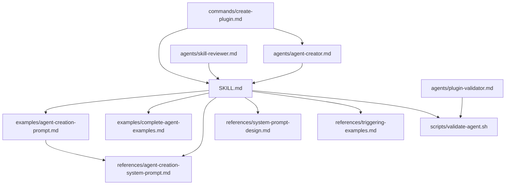

# Agent Development Skill 深度研究文档

## 文档信息
- **研究对象**: `plugins/plugin-dev/skills/agent-development/SKILL.md`
- **研究日期**: 2026-03-22
- **文档版本**: 基于 SKILL.md v0.1.0
- **所属插件**: plugin-dev (Plugin Development Toolkit)

---

## 1. 场景与职责

### 1.1 核心定位

Agent Development Skill 是 Claude Code 插件开发工具包 (plugin-dev) 的六大核心技能之一，专门负责指导开发者创建、配置和优化**自主代理 (Autonomous Agents)**。

### 1.2 使用场景

根据 SKILL.md 的 description 字段，该技能在以下场景触发：

| 触发场景 | 示例用户输入 |
|---------|-------------|
| 创建新 Agent | "create an agent", "generate an agent" |
| 添加 Agent 到插件 | "add an agent", "build a new agent" |
| Agent 配置咨询 | "agent frontmatter", "when to use description" |
| Agent 示例需求 | "agent examples", "agent tools", "agent colors" |
| 自主代理开发 | "autonomous agent", "write a subagent" |
| Agent 结构指导 | 需要了解 agent structure, system prompts, triggering conditions |

### 1.3 核心职责

该技能承担以下教育指导职责：

1. **Agent 文件结构教育**: 教授 YAML frontmatter + system prompt 的标准格式
2. **触发条件设计**: 指导如何通过 description + `<example>` 块实现可靠触发
3. **System Prompt 设计**: 提供分析型、生成型、验证型、编排型四种设计模式
4. **AI 辅助生成**: 教授使用 Claude Code 内部实现的 agent 生成提示词
5. **验证与测试**: 提供验证规则和最佳实践检查清单

### 1.4 与 Commands/Agents 的区别

根据文档关键概念：
- **Agents**: FOR autonomous work（自主多步骤任务）
- **Commands**: FOR user-initiated actions（用户发起的动作）

---

## 2. 功能点目的

### 2.1 功能架构图

```
┌─────────────────────────────────────────────────────────────────┐
│                    Agent Development Skill                       │
├─────────────────────────────────────────────────────────────────┤
│  ┌──────────────┐  ┌──────────────┐  ┌──────────────────────┐  │
│  │   核心技能    │  │   示例资源    │  │      参考文档         │  │
│  │  SKILL.md    │  │  examples/   │  │    references/       │  │
│  │  (~1,438词)  │  │              │  │                      │  │
│  └──────┬───────┘  └──────┬───────┘  └──────────┬───────────┘  │
│         │                 │                      │              │
│    • 文件结构           • AI辅助生成模板       • 系统提示词设计   │
│    • Frontmatter字段    • 完整Agent示例        • 触发示例最佳实践 │
│    • System Prompt设计  • 代码审查/测试生成    • 内部实现提示词   │
│    • 创建方法           • 安全分析/文档生成    │              │
│    • 验证规则                                                          │
│    • 组织方式                                                          │
│    • 测试方法                                                          │
└─────────────────────────────────────────────────────────────────┘
                              │
                    ┌─────────┴─────────┐
                    ▼                   ▼
            ┌──────────────┐    ┌──────────────┐
            │  validate-   │    │  plugin-dev  │
            │  agent.sh    │    │   agents/    │
            │  (脚本工具)   │    │  (实际Agent) │
            └──────────────┘    └──────────────┘
```

### 2.2 各功能点详细说明

#### 2.2.1 Agent 文件结构规范

**目的**: 标准化 Agent 定义格式，确保 Claude Code 能正确解析和加载

**核心规范**:
```markdown
---
name: agent-identifier          # 必填: 小写+连字符，3-50字符
description: Use this agent...  # 必填: 触发条件+示例
model: inherit                  # 必填: inherit/sonnet/opus/haiku
color: blue                     # 必填: blue/cyan/green/yellow/magenta/red
tools: ["Read", "Write"]        # 可选: 工具白名单
---

System Prompt 正文...           # 必填: 20-10,000字符
```

#### 2.2.2 Frontmatter 字段验证

| 字段 | 必填 | 格式约束 | 设计目的 |
|-----|------|---------|---------|
| name | 是 | `^[a-z0-9][a-z0-9-]*[a-z0-9]$`, 3-50字符 | 唯一标识，用于命名空间 |
| description | 是 | 10-5000字符，含`<example>`块 | 触发条件定义，Claude 决策依据 |
| model | 是 | inherit/sonnet/opus/haiku | 模型选择，inherit 推荐 |
| color | 是 | 6种预设颜色 | UI 视觉区分 |
| tools | 否 | 工具名数组或省略 | 最小权限原则 |

#### 2.2.3 System Prompt 设计模式

提供四种经过验证的设计模式：

1. **Analysis Agents** (分析型): 代码审查、PR分析、文档检查
2. **Generation Agents** (生成型): 代码生成、测试生成、文档生成
3. **Validation Agents** (验证型): 配置验证、结构检查、质量评估
4. **Orchestration Agents** (编排型): 多工具协调、工作流管理

#### 2.2.4 AI 辅助生成功能

**目的**: 利用 Claude 的能力自动生成高质量的 Agent 配置

**工作流程**:
1. 用户提供 Agent 需求描述
2. 使用 `agent-creation-system-prompt.md` 中的系统提示词
3. Claude 返回 JSON: `{identifier, whenToUse, systemPrompt}`
4. 转换为标准 Agent markdown 文件

#### 2.2.5 验证脚本

**validate-agent.sh** 功能：
- 检查 YAML frontmatter 结构
- 验证必填字段存在性
- 检查字段格式（name 格式、model 有效性、color 有效性）
- 验证 system prompt 长度和第二人称使用
- 统计错误和警告

---

## 3. 具体技术实现

### 3.1 关键流程

#### 3.1.1 Agent 创建流程（AI 辅助方式）

```
用户输入需求
    │
    ▼
┌─────────────────────────────────────┐
│ 使用 agent-creation-prompt.md 模板   │
│ 构造生成提示词                        │
└─────────────────────────────────────┘
    │
    ▼
调用 Claude API（带 system prompt）
    │
    ▼
接收 JSON 响应
{
  "identifier": "agent-name",
  "whenToUse": "Use this agent when...",
  "systemPrompt": "You are..."
}
    │
    ▼
转换为 Agent 文件格式
    │
    ▼
写入 agents/[identifier].md
    │
    ▼
运行 validate-agent.sh 验证
```

#### 3.1.2 Agent 触发决策流程

Claude Code 的 Agent 选择逻辑：

```
用户输入
    │
    ▼
加载所有 Agent metadata（name + description）
    │
    ▼
解析 description 中的触发条件
    │
    ▼
匹配用户输入与 <example> 块
    │
    ├── 匹配成功 ──► 加载 Agent 的 system prompt
    │                   │
    │                   ▼
    │               使用 Agent 处理任务
    │
    └── 匹配失败 ──► 继续检查其他 Agents
                        │
                        ▼
                    无匹配 ──► 直接响应或询问
```

#### 3.1.3 `<example>` 块解析协议

标准格式：
```xml
<example>
Context: [场景描述]
user: "[用户输入]"
assistant: "[触发前响应]"
<commentary>
[触发原因说明]
</commentary>
assistant: "[使用 Agent 的声明]"
</example>
```

**解析规则**:
- `Context`: 设置场景，帮助理解触发时机
- `user`: 精确匹配用户输入模式
- `assistant` (第一个): 展示 Claude 在触发前的自然响应
- `<commentary>`: 解释为什么这个 Agent 应该被触发
- `assistant` (第二个): 展示 Agent 调用声明

### 3.2 数据结构

#### 3.2.1 Agent 文件 Schema

```typescript
interface AgentFile {
  // YAML Frontmatter
  frontmatter: {
    name: string;              // 3-50 chars, lowercase-hyphens
    description: string;       // 10-5000 chars, with <example> blocks
    model: 'inherit' | 'sonnet' | 'opus' | 'haiku';
    color: 'blue' | 'cyan' | 'green' | 'yellow' | 'magenta' | 'red';
    tools?: string[];          // Optional tool whitelist
  };
  
  // Markdown Body (System Prompt)
  systemPrompt: string;        // 20-10000 chars, second person
}
```

#### 3.2.2 颜色语义映射

| 颜色 | 语义 | 适用 Agent 类型 |
|-----|------|----------------|
| blue | 分析、审查 | code-reviewer, analyzer |
| cyan | 文档、信息 | docs-generator |
| green | 生成、创建、成功 | test-generator, creator |
| yellow | 验证、警告、谨慎 | validator, checker |
| magenta | 重构、转换、创意 | transformer, refactorer |
| red | 安全、关键、错误 | security-analyzer |

#### 3.2.3 Model 选择策略

| Model | 适用场景 | 成本/性能 |
|-------|---------|----------|
| inherit | 默认推荐，继承父级模型 | 与父级一致 |
| sonnet | 平衡型任务，中等复杂度 | 中等 |
| opus | 高复杂度任务，需要深度推理 | 高 |
| haiku | 简单任务，快速响应 | 低 |

### 3.3 协议与约定

#### 3.3.1 System Prompt 写作协议

**必须遵循的结构**:
```markdown
You are [specific role] specializing in [domain].

**Your Core Responsibilities:**
1. [Primary responsibility]
2. [Secondary responsibility]
...

**[Task Name] Process:**
1. [Step one]
2. [Step two]
...

**Quality Standards:**
- [Standard 1]
- [Standard 2]
...

**Output Format:**
[Specific format requirements]

**Edge Cases:**
- [Edge case 1]: [Handling approach]
- [Edge case 2]: [Handling approach]
```

**写作风格要求**:
- ✅ 第二人称 ("You are...", "You will...")
- ✅ 具体明确 (避免 "look for security issues")
- ✅ 可操作指令 ("Check for SQL injection by examining...")
- ✅ 包含文件:行号引用要求

#### 3.3.2 命名空间协议

Agent 命名空间规则：
- 单插件内: `agent-name`
- 带子目录: `plugin:subdir:agent-name`

#### 3.3.3 工具权限协议

**最小权限原则**:
```yaml
# 只读分析
tools: ["Read", "Grep", "Glob"]

# 代码生成
tools: ["Read", "Write", "Grep"]

# 测试执行
tools: ["Read", "Bash", "Grep"]

# 完全访问（省略或）
tools: ["*"]
```

### 3.4 命令与工具

#### 3.4.1 验证脚本命令

```bash
# 验证 Agent 文件结构
./scripts/validate-agent.sh agents/my-agent.md

# 检查项：
# - 文件存在性
# - Frontmatter 结构 (--- 开始和结束)
# - 必填字段 (name, description, model, color)
# - name 格式验证 (小写、连字符、长度)
# - description 长度和示例块
# - model 有效性
# - color 有效性
# - system prompt 长度和第二人称检查
```

#### 3.4.2 Agent 创建命令（通过 create-plugin workflow）

在 `/plugin-dev:create-plugin` 命令的 Phase 5 中：

```
1. Load agent-development skill
2. 对每个 Agent:
   a. 使用 agent-creator agent 生成配置
   b. 创建 agent markdown 文件
   c. 运行 validate-agent.sh 验证
```

---

## 4. 关键代码路径与文件引用

### 4.1 核心文件结构

```
plugins/plugin-dev/
├── skills/agent-development/
│   ├── SKILL.md                          # 核心技能文档 (1,438词)
│   ├── examples/
│   │   ├── agent-creation-prompt.md      # AI辅助生成模板 (238行)
│   │   └── complete-agent-examples.md    # 4个完整示例 (427行)
│   ├── references/
│   │   ├── agent-creation-system-prompt.md  # Claude内部实现提示词 (207行)
│   │   ├── system-prompt-design.md       # 4种设计模式 (411行)
│   │   └── triggering-examples.md        # 触发示例最佳实践 (491行)
│   └── scripts/
│       └── validate-agent.sh             # 验证脚本 (217行)
│
├── agents/
│   ├── agent-creator.md                  # 实际Agent：创建新Agent
│   ├── plugin-validator.md               # 实际Agent：验证插件
│   └── skill-reviewer.md                 # 实际Agent：审查Skill
│
├── commands/
│   └── create-plugin.md                  # 8阶段插件创建工作流
│
└── README.md                             # 插件总览
```

### 4.2 关键代码路径

#### 4.2.1 Agent 定义文件路径

| 路径 | 用途 | 内容摘要 |
|-----|------|---------|
| `agents/agent-creator.md` | 创建新 Agent | 使用 sonnet 模型，magenta 颜色，tools: ["Write", "Read"] |
| `agents/plugin-validator.md` | 验证插件结构 | inherit 模型，yellow 颜色，全工具访问 |
| `agents/skill-reviewer.md` | 审查 Skill 质量 | inherit 模型，cyan 颜色，只读工具 |

#### 4.2.2 Skill 到 Agent 的调用链

```
SKILL.md (教育文档)
    │
    ├── 引用 ──► examples/agent-creation-prompt.md
    │              │
    │              └── 使用 ──► references/agent-creation-system-prompt.md
    │                              │
    │                              └── 生成 ──► agents/[new-agent].md
    │
    ├── 引用 ──► examples/complete-agent-examples.md
    │              │
    │              ├── code-reviewer (示例)
    │              ├── test-generator (示例)
    │              ├── docs-generator (示例)
    │              └── security-analyzer (示例)
    │
    ├── 引用 ──► references/system-prompt-design.md
    │              │
    │              ├── Pattern 1: Analysis Agents
    │              ├── Pattern 2: Generation Agents
    │              ├── Pattern 3: Validation Agents
    │              └── Pattern 4: Orchestration Agents
    │
    ├── 引用 ──► references/triggering-examples.md
    │              │
    │              ├── 4种示例类型
    │              ├── 多示例策略
    │              └── 调试触发问题
    │
    └── 使用 ──► scripts/validate-agent.sh
                   │
                   └── 验证 ──► agents/*.md
```

#### 4.2.3 验证脚本关键逻辑

`scripts/validate-agent.sh` 核心验证逻辑：

```bash
# 1. 提取 frontmatter 和 system prompt
FRONTMATTER=$(sed -n '/^---$/,/^---$/{ /^---$/d; p; }' "$AGENT_FILE")
SYSTEM_PROMPT=$(awk '/^---$/{i++; next} i>=2' "$AGENT_FILE")

# 2. 检查 name 字段
NAME=$(echo "$FRONTMATTER" | grep '^name:' | sed 's/name: *//')
# 验证：非空、格式^[a-zA-Z0-9][a-zA-Z0-9-]*[a-zA-Z0-9]$、长度3-50

# 3. 检查 description 字段
DESCRIPTION=$(echo "$FRONTMATTER" | grep '^description:' | sed 's/description: *//')
# 验证：非空、长度10-5000、包含<example>、包含"Use this agent when"

# 4. 检查 model 字段
MODEL=$(echo "$FRONTMATTER" | grep '^model:' | sed 's/model: *//')
# 验证：必须是 inherit/sonnet/opus/haiku 之一

# 5. 检查 color 字段
COLOR=$(echo "$FRONTMATTER" | grep '^color:' | sed 's/color: *//')
# 验证：必须是 blue/cyan/green/yellow/magenta/red 之一

# 6. 检查 system prompt
# 验证：非空、长度20-10000、包含第二人称 (You are/You will/Your)
```

### 4.3 文件依赖关系



---

## 5. 依赖与外部交互

### 5.1 内部依赖

#### 5.1.1 同插件内依赖

| 依赖组件 | 依赖类型 | 用途 |
|---------|---------|------|
| `agents/agent-creator.md` | 实际 Agent 实现 | 演示 AI 辅助生成流程 |
| `agents/plugin-validator.md` | 实际 Agent 实现 | 演示验证型 Agent 设计 |
| `agents/skill-reviewer.md` | 实际 Agent 实现 | 演示分析型 Agent 设计 |
| `commands/create-plugin.md` | 命令工作流 | 在 Phase 5 中调用本 skill |
| `skills/skill-development/SKILL.md` | 兄弟 skill | 共享渐进式披露设计原则 |

#### 5.1.2 Skill 间协作

在 `/plugin-dev:create-plugin` 工作流中：

```
Phase 2: Component Planning
    └── 使用 plugin-structure skill

Phase 5: Component Implementation
    ├── Skills ──► skill-development skill
    ├── Commands ──► command-development skill
    ├── Agents ──► agent-development skill (本skill)
    ├── Hooks ──► hook-development skill
    ├── MCP ──► mcp-integration skill
    └── Settings ──► plugin-settings skill

Phase 6: Validation
    ├── plugin-validator agent
    ├── skill-reviewer agent (针对 skills)
    └── validate-agent.sh (针对 agents)
```

### 5.2 外部交互

#### 5.2.1 Claude Code 核心系统交互

| 交互点 | 交互方式 | 说明 |
|-------|---------|------|
| Agent 发现 | 文件系统扫描 | Claude Code 扫描 `agents/` 目录自动发现 |
| Agent 加载 | YAML 解析 | 解析 frontmatter 获取 metadata |
| 触发决策 | LLM 匹配 | 使用 description 中的 `<example>` 做语义匹配 |
| Agent 执行 | Subprocess | 以独立进程运行 Agent，隔离上下文 |
| 工具调用 | API | Agent 通过 Tool 调用与系统交互 |

#### 5.2.2 模型交互

| Model | 交互场景 |
|-------|---------|
| Claude Sonnet | agent-creator 使用，需要较强的生成能力 |
| Inherit | 大多数 Agent 使用，继承父级模型 |
| Claude Opus | 复杂 Agent 可选，用于深度推理任务 |
| Claude Haiku | 简单 Agent 可选，用于快速响应任务 |

### 5.3 环境依赖

#### 5.3.1 脚本依赖

`validate-agent.sh` 依赖：
- `bash` (shell 环境)
- `sed` (frontmatter 提取)
- `awk` (system prompt 提取)
- `grep` (模式匹配)
- `head`/`tail` (文件读取)

#### 5.3.2 文件系统约定

```
插件目录/
├── agents/              # Agent 定义文件 (*.md)
│   └── *.md
├── commands/            # 命令定义文件 (*.md)
│   └── *.md
├── skills/              # Skill 目录
│   └── skill-name/
│       ├── SKILL.md
│       ├── references/
│       ├── examples/
│       └── scripts/
├── hooks/               # Hook 配置和脚本
│   ├── hooks.json
│   └── *.sh
└── .claude-plugin/
    └── plugin.json      # 插件清单
```

---

## 6. 风险、边界与改进建议

### 6.1 已知风险

#### 6.1.1 触发可靠性风险

**风险描述**: Agent 的触发完全依赖 description 中的 `<example>` 块与 LLM 的语义匹配，可能出现：
- 该触发时不触发（漏触发）
- 不该触发时触发（误触发）
- 多个 Agent 同时匹配（冲突）

**缓解措施**:
- SKILL.md 强调使用 2-4 个 diverse examples
- 包含显式和隐式触发场景
- 使用 `<commentary>` 明确解释触发逻辑
- 提供调试指南（triggering-examples.md 中的 Debugging Triggering Issues 章节）

#### 6.1.2 System Prompt 注入风险

**风险描述**: Agent 的 system prompt 来自用户可编辑的 markdown 文件，可能存在：
- Prompt 注入攻击（通过精心构造的 agent 文件）
- 权限提升（通过诱导性的 system prompt）

**现有防护**:
- tools 字段限制可用工具（最小权限）
- Agent 运行在隔离的 subprocess 中
- 上下文隔离（Agent 无父级上下文访问）

#### 6.1.3 工具权限边界模糊

**风险描述**: `tools` 字段是可选的，省略时 Agent 获得所有工具访问权限，可能违反最小权限原则。

**建议**: 验证脚本应强烈建议显式声明 tools。

### 6.2 边界限制

#### 6.2.1 文件格式边界

| 限制项 | 边界值 | 说明 |
|-------|-------|------|
| name 长度 | 3-50 字符 | 过短难以描述，过长难以记忆 |
| description 长度 | 10-5000 字符 | 过短无法充分描述，过长影响加载 |
| system prompt 长度 | 20-10000 字符 | 过短无法指导行为，过长超出上下文 |
| 示例数量 | 推荐 2-4 个 | 过少覆盖不足，过多影响决策 |

#### 6.2.2 功能边界

- Agent 无法访问父级对话上下文（设计如此，上下文隔离）
- Agent 无法修改自身的触发条件（需要修改源文件）
- Agent 无法动态调整工具权限（需要在定义中声明）

#### 6.2.3 性能边界

- Agent 启动需要 subprocess 创建开销
- 每个 Agent 独立加载 system prompt，重复内容会占用多份上下文
- 大量 Agent（>20）可能影响触发决策速度

### 6.3 改进建议

#### 6.3.1 文档改进

1. **添加 Agent 性能优化指南**
   - 当前缺失：如何设计轻量级 Agent
   - 建议：添加 "Agent Performance Tuning" 章节，涵盖 system prompt 压缩、工具精简、模型选择

2. **扩展测试方法**
   - 当前：仅提及测试触发和 system prompt 完整性
   - 建议：添加自动化测试框架，支持定义测试用例并验证 Agent 行为

3. **添加 Troubleshooting 章节**
   - 当前：分散在各 reference 文档中
   - 建议：集中常见问题（Agent 不触发、触发错误、行为异常等）的排查流程

#### 6.3.2 功能改进

1. **增强验证脚本**
   ```bash
   # 建议添加：
   # - 检查 description 中触发短语的唯一性（避免与其他 Agent 冲突）
   # - 检查 system prompt 中的工具引用是否匹配 tools 字段
   # - 检查示例格式是否严格符合规范
   # - 生成测试建议命令
   ```

2. **添加 Agent 模板生成器**
   - 当前：需要手动从示例复制
   - 建议：提供 `create-agent-from-template` 脚本，交互式选择模板类型

3. **支持 Agent 继承/组合**
   - 当前：每个 Agent 独立定义
   - 建议：支持 `extends: base-agent` 语法，继承并覆盖 base agent 配置

#### 6.3.3 架构改进

1. **Agent 版本管理**
   - 当前：无版本概念
   - 建议：在 frontmatter 添加 `version` 字段，支持 Agent 迭代和兼容性检查

2. **动态工具加载**
   - 当前：tools 静态声明
   - 建议：支持运行时工具发现（如根据项目类型自动启用相关工具）

3. **Agent 间通信机制**
   - 当前：Agent 完全隔离
   - 建议：支持 Agent 调用其他 Agent（通过特定工具），形成 Agent 编排

### 6.4 与相关系统的对比

| 特性 | Agent Development Skill | OpenAI GPTs | LangChain Agents |
|-----|------------------------|-------------|------------------|
| 定义格式 | Markdown + YAML | Web UI / API | Python 代码 |
| 触发方式 | LLM 语义匹配 + Examples | 用户选择 / 关键词 | 显式代码调用 |
| System Prompt | 完整支持 | 支持 (Instructions) | 支持 |
| 工具限制 | 声明式白名单 | 声明式 | 代码级控制 |
| 上下文隔离 | 完全隔离 | 完全隔离 | 可选 |
| 版本控制 | Git 友好 | 平台托管 | Git 友好 |
| 可移植性 | 高（纯文本） | 中（平台绑定） | 高（代码） |

---

## 7. 附录

### 7.1 术语表

| 术语 | 定义 |
|-----|------|
| Agent | Claude Code 中的自主子进程，处理复杂多步骤任务 |
| Frontmatter | YAML 格式的文件头部元数据，位于 `---` 之间 |
| System Prompt | 定义 Agent 行为的指令文本，markdown body 部分 |
| Triggering | Claude 决定使用某个 Agent 的过程 |
| `<example>` | 描述 Agent 触发场景的 XML 风格标记块 |
| `<commentary>` | 解释触发逻辑的 XML 风格标记 |
| Progressive Disclosure | 渐进式披露设计原则，分层加载信息 |
| Skill | 提供特定领域知识和工作流的模块化组件 |

### 7.2 参考链接

- 研究对象: `/home/sansha/Github/claude-code/plugins/plugin-dev/skills/agent-development/SKILL.md`
- 示例目录: `/home/sansha/Github/claude-code/plugins/plugin-dev/skills/agent-development/examples/`
- 参考目录: `/home/sansha/Github/claude-code/plugins/plugin-dev/skills/agent-development/references/`
- 脚本目录: `/home/sansha/Github/claude-code/plugins/plugin-dev/skills/agent-development/scripts/`
- 实际 Agent: `/home/sansha/Github/claude-code/plugins/plugin-dev/agents/`

### 7.3 统计信息

| 指标 | 数值 |
|-----|------|
| SKILL.md 字数 | ~1,438 词 |
| 示例文档总数 | 2 个 |
| 参考文档总数 | 3 个 |
| 脚本工具数 | 1 个 |
| 配套实际 Agent 数 | 3 个 |
| 总代码/文档行数 | ~2,500+ 行 |

---

*文档结束*
